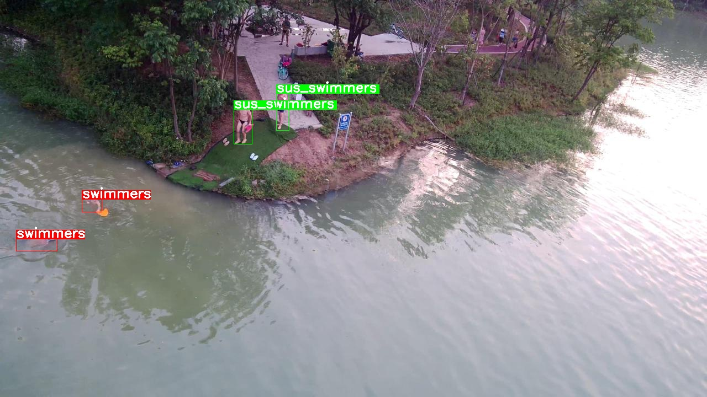
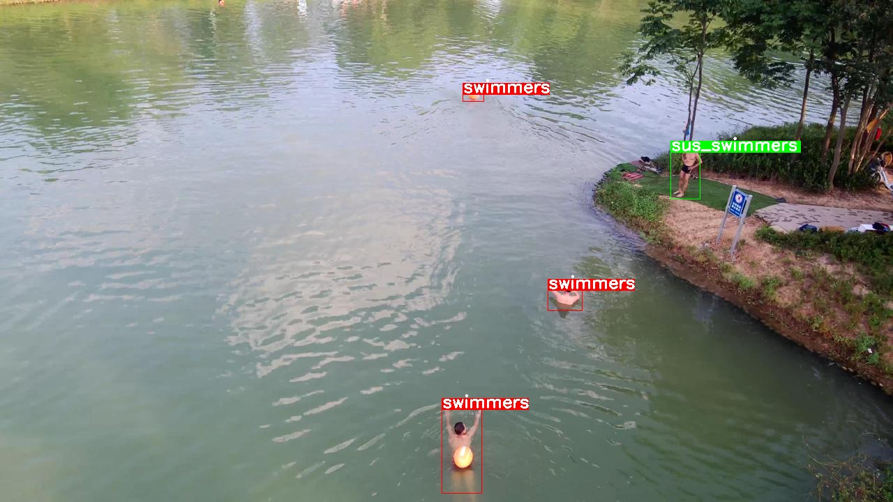
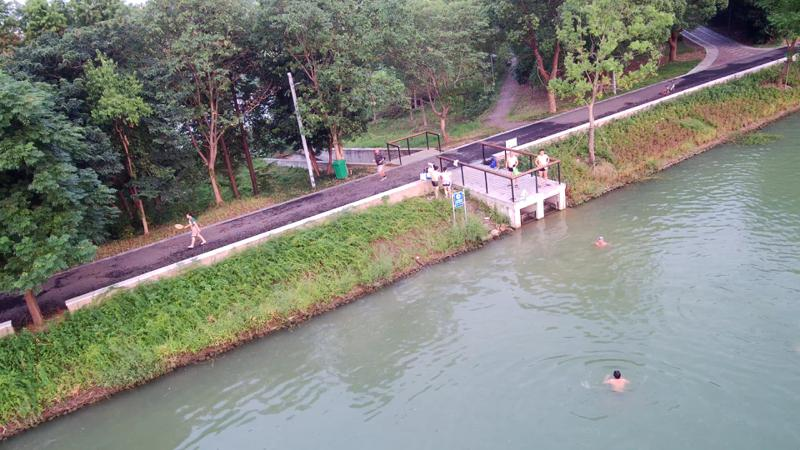

正逐步完善本文档

运行本目录下的程序需要使用PaddlePaddle v0.10.0 版本。如果您的PaddlePaddle安装版本低于此要求，请按照[安装文档](http://www.paddlepaddle.org/documentation/docs/zh/0.14.0/new_docs/beginners_guide/install/install_doc.html)中的说明更新PaddlePaddle安装版本。

---

# 游泳者目标检测
## 概述
本系统针对户外野泳者设计。利用无人机拍摄水面情况，使用PaddlePaddle搭建的SSD算法对拍摄数据进行检测并识别；若有野泳者，则触发警报器，将信息上传至相关管理部门，派遣人员对野泳者进行驱散。

## 项目总览
本项目共包含如下文件：

<table>
<caption>表1. 示例文件</caption>
<tr><th>文件</th><th>用途</th></tr>
<tr><td>train.py</td><td>训练脚本</td></tr>
<tr><td>eval.py</td><td>评估脚本，用于评估训好模型</td></tr>
<tr><td>infer.py</td><td>检测脚本，给定图片及模型，实施检测</td></tr>
<tr><td>visual.py</td><td>检测结果可视化</td></tr>
<tr><td>image_util.py</td><td>图像预处理所需公共函数</td></tr>
<tr><td>data_provider.py</td><td>数据处理脚本，生成训练、评估或检测所需数据</td></tr>
<tr><td>vgg_ssd_net.py</td><td>神经网络结构</td></tr>
<tr><td>config/pascal_voc_conf.py</td><td>神经网络超参数配置文件</td></tr>
<tr><td>data/label_list</td><td>类别列表</td></tr>
<tr><td>data/pre.py</td><td>创建infer数据列表</td></tr>
<tr><td>data/prepare_voc_data.py</td><td>准备训练及测试数据列表</td></tr>
<tr><td>vgg/vgg_model.tar.gz</td><td>预训练模型</td></tr>
<tr><td>data/VOCdevkit/VOC2007/split.py</td><td>划分训练集、测试集</td></tr>
</table>

训练阶段需要对数据做预处理，包括裁剪、采样等，这部分操作在```image_util.py```和```data_provider.py```中完成。


### 数据准备
1. VOC2007格式数据集制作简介，按照[此文档](https://blog.csdn.net/gulingfengze/article/details/79639111)即可。

2. 数据集：Swim2000\[[下载地址](https://pan.baidu.com/s/1KPC4tZZDwOjCnFLhzCZ5aA)\],将下载好的数据解压，放到data/VOCdevkit/VOC2007/下面，部分数据如下所示：

<p align="center">




图1. Swim2000部分数据
</p>

3. 进入```data/VOCdevkit/VOC2007```目录，运行```python split.py```即可在```data/VOCdevkit/VOC2007/ImageSets/Main```下生成test.txt、train.txt、trainval.txt和val.txt。核心函数为：

    ```python
    for i in list:  
        name=total_xml[i][:-4]+'\n'
        if i in trainval:  
            ftrainval.write(name)  
            if i in train:  
                ftrain.write(name)  
            else:  
                fval.write(name)  
        else:  
            ftest.write(name)
     ```

4. 进入```data```目录，运行```python prepare_voc_data.py```即可生成```trainval.txt```和```test.txt```。核心函数为：

    ```python
    def prepare_filelist(devkit_dir, years, output_dir):
        trainval_list = []
        test_list = []
        for year in years:
            trainval, test = walk_dir(devkit_dir, year)
            trainval_list.extend(trainval)
            test_list.extend(test)
        random.shuffle(trainval_list)
        with open(osp.join(output_dir, 'trainval.txt'), 'w') as ftrainval:
            for item in trainval_list:
                ftrainval.write(item[0] + ' ' + item[1] + '\n')

        with open(osp.join(output_dir, 'test.txt'), 'w') as ftest:
            for item in test_list:
                ftest.write(item[0] + ' ' + item[1] + '\n')
    ```

   该函数将训练图像的文件路径列表进行随机乱序，最后保存训练文件列表和测试文件列表。默认```prepare_voc_data.py```和```VOCdevkit```在相同目录下，且生成的文件列表也在该目录次数。

   下面是```trainval.txt```前几行输入示例：

    ```text
    ./VOCdevkit/VOC2007/JPEGImages/001767.jpg ./VOCdevkit/VOC2007/Annotations/001767.xml
    ./VOCdevkit/VOC2007/JPEGImages/000375.jpg ./VOCdevkit/VOC2007/Annotations/000375.xml
    ./VOCdevkit/VOC2007/JPEGImages/001424.jpg ./VOCdevkit/VOC2007/Annotations/001424.xml
    ./VOCdevkit/VOC2007/JPEGImages/001671.jpg ./VOCdevkit/VOC2007/Annotations/001671.xml

    ```

    文件共两个字段，第一个字段为图像文件的相对路径，第二个字段为对应标注文件的相对路径。

### 预训练模型准备
我们提供了一个转换好的模型，并将其放置路径为```vgg/vgg_model.tar.gz```。

### 模型训练
直接执行```python train.py```即可进行训练。需要注意本示例仅支持CUDA GPU环境，无法在CPU上训练，主要因为使用CPU训练速度很慢，实践中一般使用GPU来处理图像任务，这里实现采用硬编码方式使用cuDNN，不提供CPU版本。```train.py```的一些关键执行逻辑：

```python
paddle.init(use_gpu=True, trainer_count=1)
data_args = data_provider.Settings(
                data_dir='./data',
                label_file='label_list',
                resize_h=cfg.IMG_HEIGHT,
                resize_w=cfg.IMG_WIDTH,
                mean_value=[104,117,124])
train(train_file_list='./data/trainval.txt',
      dev_file_list='./data/test.txt',
      data_args=data_args,
      init_model_path='./vgg/vgg_model.tar.gz')
```

主要包括：

1. 调用```paddle.init```指定使用1卡GPU训练。
2. 调用```data_provider.Settings```配置数据预处理所需参数，其中```cfg.IMG_HEIGHT```和```cfg.IMG_WIDTH```在配置文件```config/vgg_config.py```中设置，这里均为300，300x300是一个典型配置，兼顾效率和检测精度，也可以通过修改配置文件扩展到512x512。
3. 调用```train```执行训练，其中```train_file_list```指定训练数据列表，```dev_file_list```指定评估数据列表，```init_model_path```指定预训练模型位置。
4. 训练过程中会打印一些日志信息，每训练1个batch会输出当前的轮数、当前batch的cost及mAP（mean Average Precision，平均精度均值），每训练一个pass，会保存一次模型，默认保存在```checkpoints```目录下（注：需事先创建）。

VGG-SDD 300x300在Swim2000数据集上的mAP可达到88.53%。


### 模型评估
执行```python eval.py```即可对模型进行评估，```eval.py```的关键执行逻辑如下：

```python
paddle.init(use_gpu=True, trainer_count=1)  # use 1 gpus

data_args = data_provider.Settings(
    data_dir='./data',
    label_file='label_list',
    resize_h=cfg.IMG_HEIGHT,
    resize_w=cfg.IMG_WIDTH,
    mean_value=[104, 117, 124])

eval(
    eval_file_list='./data/test.txt',
    batch_size=4,
    data_args=data_args,
    model_path='models/pass-00000.tar.gz')
```

调用```paddle.init```指定使用1卡GPU评估；```data_provider.Settings```参见训练阶段的配置；调用```eval```执行评估，其中```eval_file_list```指定评估数据列表，```batch_size```指定评估时batch size的大小，```model_path ```指定模型的位置。评估结束会输出```loss```信息和```mAP```信息。

### 图像检测
1. 将新数据放进```data/infer```下面，进入```data```目录，执行```python pre.py```，在当前目录下生成infer.txt，前几行内容如下：

    ```text
    ./infer/002837.jpg
    ./infer/002852.jpg
    ./infer/002836.jpg
    ./infer/002830.jpg
    ```
2. 执行```python infer.py```即可使用训练好的模型对图片实施检测，```infer.py```关键逻辑如下：

```python
infer(
    eval_file_list='./data/infer.txt',
    save_path='infer.res',
    data_args=data_args,
    batch_size=4,
    model_path='models/pass-00000.tar.gz',
    threshold=0.3)
```

其中```eval_file_list```指定图像路径列表；```save_path```指定预测结果保存路径；```data_args```如上；```batch_size```为每多少样本预测一次；```model_path```指模型的位置；```threshold```为置信度阈值，只有得分大于或等于该值的才会输出。下面给出```infer.res```的一些输出样例：

```text
./infer/000644.jpg	0	0.90912545	618.6149978637695 44.002389907836914 636.5362167358398 61.31969690322876
./infer/000644.jpg	0	0.843169	502.39967346191406 388.5218381881714 553.3780670166016 440.4877710342407
./infer/000644.jpg	0	0.8003719	674.1058349609375 307.59012937545776 711.6824340820312 343.5738730430603
```

共包含4个字段，以tab分割，第一个字段是检测图像路径，第二字段为检测矩形框内类别，第三个字段是置信度，第四个字段是4个坐标值（以空格分割）。

还有一个可视化脚本，直接运行```python visual.py```即可，须指定输出检测结果路径及输出目录，默认可视化后图像保存在```./visual_res```，下面是用训练好的模型infer部分图像并可视化的效果：

<p align="center">


图3. SSD300x300 检测可视化示例
</p>
